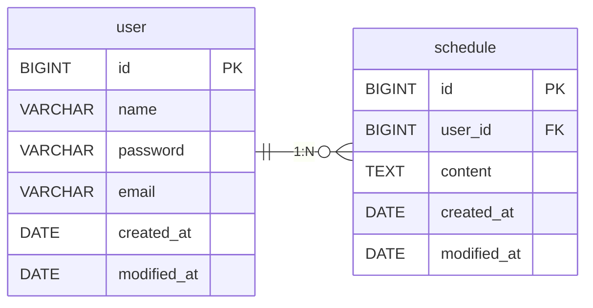
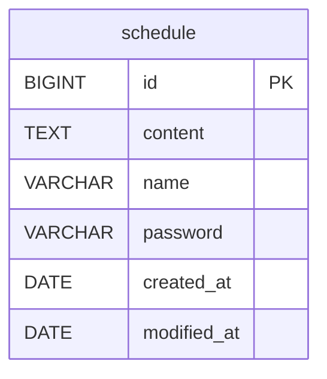

## 레벨별 브랜치 및 PR 목록

| 레벨 | 브랜치 | PR |
| --- | --- | --- |
| 레벨 0 | [level/0](https://github.com/doorcs/java-schedule-project/tree/level/0) | [PR #1](https://github.com/doorcs/java-schedule-project/pull/1) |
| 레벨 1 | [level/1](https://github.com/doorcs/java-schedule-project/tree/level/1) | [PR #2](https://github.com/doorcs/java-schedule-project/pull/2) |
| 레벨 2 | [level/2](https://github.com/doorcs/java-schedule-project/tree/level/2) | [PR #3](https://github.com/doorcs/java-schedule-project/pull/3) |
| 레벨 3 | [level/3](https://github.com/doorcs/java-schedule-project/tree/level/3) | [PR #4](https://github.com/doorcs/java-schedule-project/pull/4) |
| 레벨 4 | [level/4](https://github.com/doorcs/java-schedule-project/tree/level/4) | [PR #5](https://github.com/doorcs/java-schedule-project/pull/5) |
| 레벨 5 | [level/5](https://github.com/doorcs/java-schedule-project/tree/level/5) | [PR #6](https://github.com/doorcs/java-schedule-project/pull/6) |
| 레벨 6 | [level/6](https://github.com/doorcs/java-schedule-project/tree/level/6) | [PR #7](https://github.com/doorcs/java-schedule-project/pull/7) |

### API 명세 및 ERD 버전
| 레벨 | 버전 |
| --- | :---: |
| 레벨 0, 레벨 1, 레벨 2 | v1 |
| 레벨 3, 레벨 4, 레벨 5, 레벨 6 | v2 |

- - -

## API 명세 (v2)

| 기능 | 메서드 | URL | 요청 | 응답 | 상태 코드 |
| --- | --- | --- | --- | --- | --- |
| 회원가입 | POST | `/api/v2/auth/signup` | RequestBody | ResponseBody | 200, 400 |
| 로그인 | POST | `/api/v2/auth/signin` | RequestBody | Cookie, ResponseBody | 200, 400 |
| 로그아웃 | POST | `/api/v2/auth/signout` | Cookie | ResponseBody | 200, 400 | <!-- 로그아웃을 GET으로 구현하면 안된다!!! -->
| - | - | - | - | - | - | <!-- 비밀번호 검증을 위해 RequestBody도 함께 요청 -->
| 회원정보 수정 | POST | `/api/v2/auth/me` | Cookie, RequestBody | ResponseBody | 200, 400 |
| 회원 탈퇴 | DELETE | `/api/v2/auth/me` | Cookie, RequestBody | ResponseBody | 200, 400 |
| - | - | - | - | - | - |
| 전체 일정 조회 | GET | `/api/v2/schedules` | (optional) QueryString | ResponseBody | 200 |
| 선택 일정 조회 | GET | `/api/v2/schedules/{id}` | PathVariable | ResponseBody | 200, 404 |
| - | - | - | - | - | - | <!-- 일정 생성, 수정, 삭제는 로그인 요구 -->
| 일정 생성 | POST | `/api/v2/schedules` | Cookie, RequestBody | ResponseBody | 200, 400 |
| 일정 수정 | PUT | `/api/v2/schedules/{id}` | Cookie, PathVariable, RequestBody | ResponseBody | 200, 400, 404 |
| 일정 삭제 | DELETE | `/api/v2/schedules/{id}` | Cookie, PathVariable, RequestBody | ResponseBody | 200, 400, 404 |

<details>
<summary>0-2단계 API 명세 (v1)</summary>

## API 명세 (v1)

| 기능 | 메서드 | URL | 요청 | 응답 | 상태 코드 |
| --- | --- | --- | --- | --- | --- |
| 일정 생성 | POST | `/api/v1/schedules` | RequestBody | ResponseBody | 200, 400 |
| 전체 일정 조회 | GET | `/api/v1/schedules` | (optional) QueryString | ResponseBody | 200 |
| 선택 일정 조회 | GET | `/api/v1/schedules/{id}` | PathVariable | ResponseBody | 200, 404 |
| 일정 수정 | PUT | `/api/v1/schedules/{id}` | PathVariable, RequestBody | ResponseBody | 200, 400, 404 |
| 일정 삭제 | DELETE | `/api/v1/schedules/{id}` | PathVariable, RequestBody | ResponseBody | 200, 400, 404 |
</details>

## ERD (v2)


- SQL
```sql
CREATE TABLE user (
    id BIGINT AUTO_INCREMENT PRIMARY KEY,
    name VARCHAR(255) NOT NULL,
    password VARCHAR(255) NOT NULL,
    email VARCHAR(255) NOT NULL UNIQUE,
    created_at DATE,
    modified_at DATE
);

CREATE TABLE schedule (
    id BIGINT AUTO_INCREMENT PRIMARY KEY,
    user_id BIGINT NOT NULL,
    content TEXT NOT NULL,
    created_at DATE,
    modified_at DATE,
    FOREIGN KEY (user_id) REFERENCES user(id)
);
```

<details>
<summary>0-2단계 ERD (v1)</summary>

## ERD (v1)


- SQL
```sql
CREATE TABLE schedule (
    id BIGINT AUTO_INCREMENT PRIMARY KEY,
    content TEXT NOT NULL,
    name VARCHAR(255) NOT NULL,
    password VARCHAR(255) NOT NULL,
    created_at DATE,
    modified_at DATE
);
```
</details>
