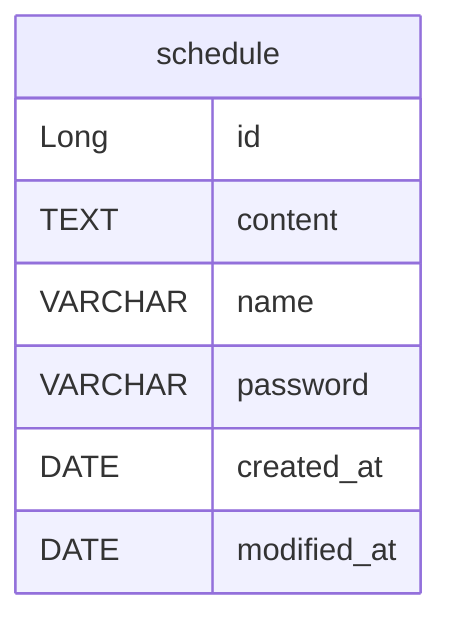

## API 명세

| 기능 | 메서드 | URL | 요청 | 응답 | 상태 코드 |
| --- | --- | --- | --- | --- | --- |
| 일정 생성 | POST | `/api/v1/schedules` | RequestBody | ResponseBody | 201 |
| 전체 일정 조회 | GET | `/api/v1/schedules` | - | ResponseBody | 200|
| 선택 일정 조회 | GET | `/api/v1/schedules/{id}` | QueryString | ResponseBody | 200 또는 404 |
| 일정 수정 | PUT | `/api/v1/schedules/{id}` | QueryString, RequestBody | ResponseBody | 200 또는 404 |
| 일정 삭제 | DELETE | `/api/v1/schedules/{id}` | QueryString, RequestBody | ResponseBody | 200 또는 404 |

## ERD



<details>
<summary>테이블 생성 SQL</summary>

```sql
CREATE TABLE schedule (
    id BIGINT AUTO_INCREMENT PRIMARY KEY,
    content TEXT NOT NULL,
    name VARCHAR(255) NOT NULL,
    password VARCHAR(255) NOT NULL,
    created_at DATE,
    modified_at DATE
);
```
</details>